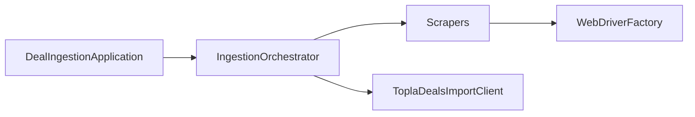

# Topla Deal Ingestion

Topla web uygulamasından **bağımsız** çalışan bir Java servisi: harici e-ticaret sitelerinden Selenium ile deal verisi toplar, ortak modele normalize eder ve **yalnızca iç API** üzerinden Topla’ya gönderir. Topla UI’si otomatik edilmez; veritabanına doğrudan bağlanılmaz.

## Mimari özeti

| Katman | Açıklama |
|--------|----------|
| `runner` | `DealIngestionApplication` — giriş noktası |
| `service` | `IngestionOrchestrator` — scraper sırası, doğrulama, API çağrısı, hata izolasyonu |
| `scraper` | `BaseScraper` + `AmazonTrScraper` (sabit URL’ler), `AmazonDealsHubScraper` (hub + rastgele N), `TrendyolScraper`, … |
| `driver` | `WebDriverFactory` — headless, tarayıcı seçimi |
| `client` | `ToplaDealsImportClient` — `POST /internal/deals/import` |
| `model` | `NormalizedDeal`, `DealImportRequest`, `ImportMetadata` |
| `config` | `AppConfig` — env + `.env` birleşimi |
| `util` | `DealValidator`, `Jsons` |



## Gereken ortam değişkenleri

Zorunlu:

- `TOPLA_API_BASE_URL` — ör. `https://topla.online` (sonunda `/` olmadan)
- `TOPLA_IMPORT_API_KEY` — iç import API anahtarı (repoda tutulmaz)

İsteğe bağlı / önerilen:

- `TOPLA_ACTOR_KEY` — mantıksal bot kimliği (ör. `topla_trendyol_bot`, `topla_amazon_bot`). **deal-radar** tarafında `TOPLA_IMPORT_ACTOR_MAP` içinde aynı string → Supabase `auth.users` UUID eşlemesi tanımlı olmalı; istek gövdesinde ham kullanıcı UUID gönderilmez.
- `INGESTION_SOURCES` — virgülle ayrılmış kaynaklar: `amazon`, `trendyol` (varsayılan: `amazon`).
- `AMAZON_START_URL` — tek sayfa modu: scraper’ın açacağı URL (ürün sayfası önerilir; yoksa `https://www.amazon.com.tr/`).
- `AMAZON_URLS` — virgülle ayrılmış birden fazla ürün/liste URL’si; **her URL için bir deal** üretilir (ör. 2 deal için iki link). Tanımlıysa `AMAZON_START_URL` yok sayılır.
- `AMAZON_MODE` — `urls` (varsayılan): yukarıdaki sabit URL listesi. `hub`: fırsat sayfası (`AMAZON_DEALS_HUB_URL`) açılır, indirim heuristiğiyle aday linkler toplanır, karıştırılır, en fazla `AMAZON_DEALS_TARGET_COUNT` ürün detayı çekilir. `java -jar` `.feature` dosyası okumaz; Cucumber’daki örnek adetleriyle aynı sayıyı burada verin.
- `AMAZON_DEALS_HUB_URL` — hub modunda açılacak liste sayfası (varsayılan: `https://www.amazon.com.tr/deals`).
- `AMAZON_DEALS_TARGET_COUNT` — hub modunda en fazla kaç deal (varsayılan: `5`, en az `1`).
- `AMAZON_DEALS_RANDOM_SEED` — opsiyonel; verilirse karıştırma tekrarlanabilir olur.
- Hub modu **bot koruması, DOM değişimi ve Amazon ToS** riski taşır; üretimde dikkatli kullanın.
- `HEADLESS` — `true` / `false` (varsayılan: `true`)
- `BROWSER` — `chrome`, `firefox`, `edge` (varsayılan: `chrome`)
- `PAGE_LOAD_TIMEOUT_MS`, `IMPLICIT_WAIT_MS`
- `API_RETRY_COUNT`, `API_RETRY_DELAY_MS`, `API_CONNECT_TIMEOUT_MS`, `API_REQUEST_TIMEOUT_MS`

Yerel geliştirme için proje köküne `.env` kopyalayın: [`.env.example`](.env.example).

## Actor çözümlemesi ve güvenlik

- İstemci, deal’ı **hangi gerçek kullanıcı adına** oluşturacağını serbest bir `userId` ile **belirleyemez**; bu, açık kimlik taklidi riski yaratır.
- Önerilen sunucu tarafı modeli:
  - **Seçenek A:** Her `TOPLA_IMPORT_API_KEY` tek bir önceden tanımlı bot/system kullanıcısına eşlenir.
  - **Seçenek B:** API anahtarı + `actorKey` birlikte gelir; backend, bu anahtar için izinli `actorKey` listesini kontrol eder ve yalnızca eşleşen bot kullanıcısına yazar.
- Bu repo, `DealImportRequest` içinde `actorKey` ve `metadata` gönderir; **asıl eşleştirme ve yetkilendirme Topla backend’inde** yapılmalıdır.
- İstemciden gelen `createdByUserId` gibi alanlar ya hiç kabul edilmemeli ya da yok sayılmalıdır.

### Yeni bir bot/system import kullanıcısı eklemek (backend tarafı)

1. Platformda yeni bot kullanıcı hesabı oluşturun (ör. `topla_amazon_bot`).
2. İlgili import API anahtarını bu botla veya `actorKey` whitelist’i ile ilişkilendirin.
3. İstemci `.env` içinde `TOPLA_ACTOR_KEY` veya kaynak→actor haritasını günceller.

## İç API sözleşmesi (özet)

- **Endpoint:** `POST {TOPLA_API_BASE_URL}/internal/deals/import`
- **Kimlik doğrulama:** `Authorization: Bearer <TOPLA_IMPORT_API_KEY>`

### Örnek JSON gövdesi (deal-radar uyumlu alan adları)

`NormalizedDeal` Jackson ile `deal_price`, `external_url`, `start_at`, `end_at`, `end_date_unknown` vb. **snake_case** olarak serileştirilir; deal-radar `POST /internal/deals/import` route’u ile uyumludur.

```json
{
  "deal": {
    "title": "Örnek ürün",
    "description": "Kısa açıklama",
    "deal_price": 99.99,
    "original_price": 149.99,
    "discount_percent": 33.33,
    "image_url": "https://cdn.example.com/img.jpg",
    "external_url": "https://www.trendyol.com/...",
    "provider": "Trendyol",
    "category": "Elektronik",
    "currency": "TL",
    "country": "GLOBAL",
    "start_at": "2026-03-22T00:00:00.000Z",
    "end_at": "2026-03-29T23:59:59.000Z",
    "end_date_unknown": false
  },
  "actorKey": "topla_trendyol_bot",
  "sourceName": "Trendyol",
  "metadata": {
    "importSource": "Trendyol",
    "importedVia": "deal-ingestion-v1",
    "importJobId": "550e8400-e29b-41d4-a716-446655440000",
    "originalProductUrl": "https://www.trendyol.com/...",
    "externalId": "ty-12345",
    "reviewStatus": "pending_review"
  }
}
```

Bilinmeyen bitiş için scraper `end_date_unknown: true` bırakabilir; `DealImportPreparer` `end_at` için uzak bir tarih doldurur (deal-radar `deal.end_at` zorunluluğu).

Sunucu, `metadata` ile birlikte görünür oluşturucuyu (bot) ve teknik iz bilgisini kalıcı olarak saklayacak şekilde tasarlanmalıdır.

### deal-radar (Topla) yerel çalıştırma — kısa kontrol listesi

Import’un uçtan uca çalışması için **deal-radar** projesinde en azından: `TOPLA_IMPORT_API_KEY`, `TOPLA_IMPORT_ACTOR_MAP` (veya varsayılan bot + allowlist), `SUPABASE_SERVICE_ROLE_KEY`, `NEXT_PUBLIC_SUPABASE_URL`. Ayrıntılı adımlar ve `curl` örneği: deal-radar içinde `docs/INTERNAL_IMPORT.md`.

## Nasıl çalıştırılır

```bash
cd topla-deal-ingestion
copy .env.example .env
# .env içinde TOPLA_API_BASE_URL ve TOPLA_IMPORT_API_KEY değerlerini doldurun

mvn clean package
java -jar target/topla-deal-ingestion-1.0.0-SNAPSHOT.jar
```

Bağımlılıklar `target/lib/` altına kopyalanır; manifest classpath ile yüklenir.

Alternatif:

```bash
mvn exec:java
```

## Yeni bir scraper eklemek

1. `online.topla.ingestion.scraper.base.BaseScraper` sınıfını extend edin.
2. Sınıfı `scraper/sources/` altına koyun (ör. `HepsiburadaScraper`).
3. `IngestionOrchestrator.defaultScrapers()` veya `main` içindeki listeye `HepsiburadaScraper::new` ekleyin.
4. API tarafında gerekirse yeni `actorKey` ve whitelist girişi yapın.

## Testler

```bash
mvn test
```

- JUnit: `DealValidatorTest`
- Cucumber (BDD iskeleti): `CucumberSuiteTest` + `src/test/resources/features/` (`deal_import.feature`, `amazon_deals.feature` — hub adet sözleşmesi)

## Gelecek geliştirmeler (tasarıma uygun)

- Zamanlayıcı (cron) ile periyodik çalıştırma
- Duplicate detection ve kategori eşlemesi
- Başlık temizliği (AI)
- Hata anında ekran görüntüsü
- Proxy ve gelişmiş anti-bot

---

## Kısa mimari özeti

Modüler scraper katmanı normalize `NormalizedDeal` üretir; orchestrator doğrular, run/job kimliği ekler ve güvenli `actorKey` + metadata ile iç API’ye iletir. Selenium sürücü yönetimi tek yerde toplanır; API istemcisi scraper’dan ayrıdır.

## Önerilen sonraki adımlar

1. Topla backend’de `/internal/deals/import` sözleşmesini ve actor whitelist’i netleştirmek.
2. Bir kaynak için gerçek URL ve CSS/XPath seçicileriyle `TrendyolScraper`ı üretim seviyesine yaklaştırmak.
3. Staging’de uçtan uca test ve hata/alerting (ör. başarısız import oranı).

## İskeletten sonra ilk yapılacak iş

**Backend import endpoint’i ve actor eşlemesini** netleştirip tek bir gerçek kaynakta (ör. Trendyol kampanya sayfası) uçtan uca doğrulama — scraper mantığı ve API sözleşmesi birlikte kilitlenir.
